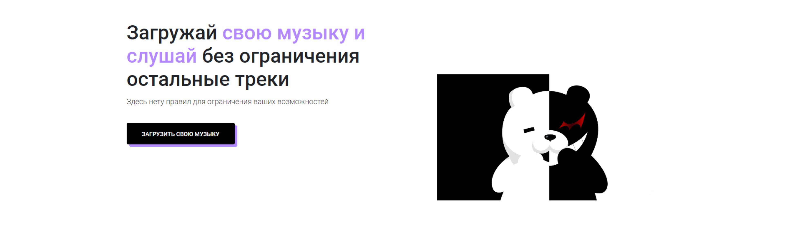

# Хостинг музыки

Данный сайт был разработан для понимание работы с audio и image на практики. Здесь можно добавить свою музыку вместе с картинкой, сама музыка при воспроизведение визуализируется в прямом Эфире в виде черточек и тем самым создают эффект проигрывания музыки . Сайт адаптивен под мобильные устройства, для адаптивной верстки использовалась технология Bootstrap. Pixel perfect верстка, дизайн и сама идея сайта была разработана также мною.
# Используемые технологии

